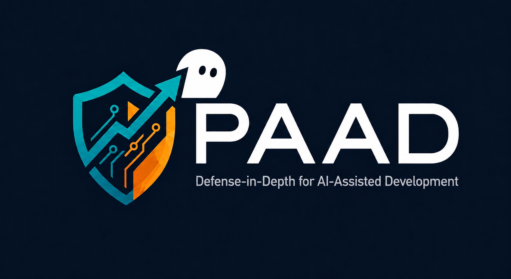

# paad-power — PAAD as a Kiro Power

<p align="center">
  
</p>

This repository is the **Kiro power** distribution of [PAAD](https://github.com/Ovid/paad) — *Defense-in-Depth for AI-Assisted Development*. It packages PAAD's skills as Kiro **manual steering files** so you can install them into Kiro with a single **Import from GitHub**.

> **Generated — do not hand-edit.** Every file here (`POWER.md` and `steering/`) is generated from the canonical skills in the [`paad`](https://github.com/Ovid/paad) repository by `make kiro`. To change a skill, edit it in `paad` and regenerate; edits made directly here are overwritten.

## What it provides

PAAD adds the missing safeguards to AI-assisted development. Each skill is exposed as a **manual steering file** the agent loads on demand:

| Steering file | What it does |
|---------------|--------------|
| `#pushback` | Push back on specs, PRDs, requirements, and design docs — finds oversized scope, contradictions, feasibility issues, omissions, ambiguity, and security concerns before implementation begins |
| `#alignment` | Check that requirements, designs, and implementation plans are aligned — finds coverage gaps, scope creep, and design mismatches, then rewrites tasks in TDD red/green/refactor format |
| `#agentic-architecture` | Multi-agent architecture analysis — dispatches specialists for structure, coupling, integration, error handling, and security, then reports strengths and flaws with evidence |
| `#fix-architecture` | Guided fixing of architectural flaws from an `agentic-architecture` report — validates findings, writes tests, and applies fixes with developer approval |
| `#agentic-review` | Thorough multi-agent review of the current branch for bugs before pushing or merging |
| `#agentic-a11y` | Multi-agent accessibility audit (web, mobile, desktop, CLI, games) with WCAG 2.2 AA/AAA ratings |
| `#vibe` | Safe vibe coding with TDD guardrails — for small fixes where you want speed but not recklessness |

## Install into Kiro

In Kiro, choose **Add Custom Power → Import from GitHub** and use this repository's URL:

```
https://github.com/Ovid/paad-power
```

Kiro reads the root `POWER.md` and the `steering/` directory. Each PAAD skill becomes a manual steering file, which you invoke through Kiro's native `/` slash-command list (or by typing `#<name>`, for example `#pushback`). When PAAD is updated, pull the changes in with Kiro's **refresh from remote**.

This install path is newly added and experimental, so a real install test is appreciated.

**No arguments.** Kiro slash commands take no arguments. Where a Claude Code skill accepts a path or scope (for example `/paad:agentic-architecture src/`), in the Kiro power you instead invoke the steering file and then state the scope in your chat message — for example, after invoking `agentic-architecture`, say "review `src/`". The skill reads the scope from your message rather than from a command argument.

**Trust note.** Importing the power from a GitHub URL injects steering files that dispatch multi-agent workflows — the same trust boundary as installing the Claude Code plugin. Install it only from a source you trust.

## Learn more

Full documentation, the Claude Code plugin, and support for Cursor and Antigravity live in the main repository: **https://github.com/Ovid/paad**
